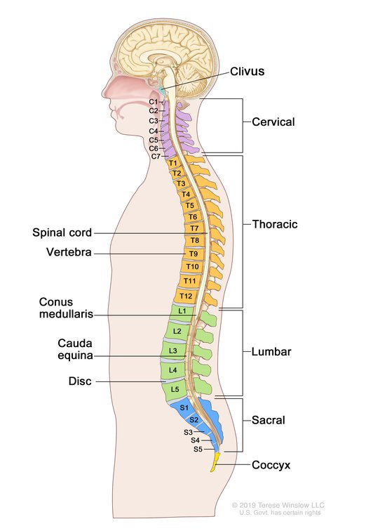
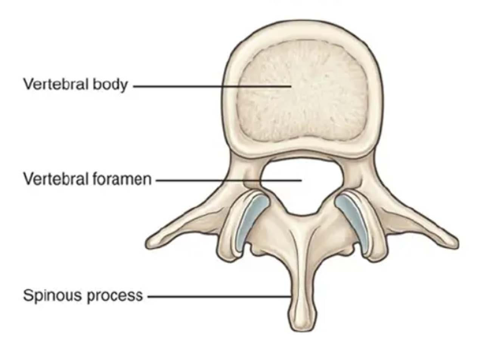
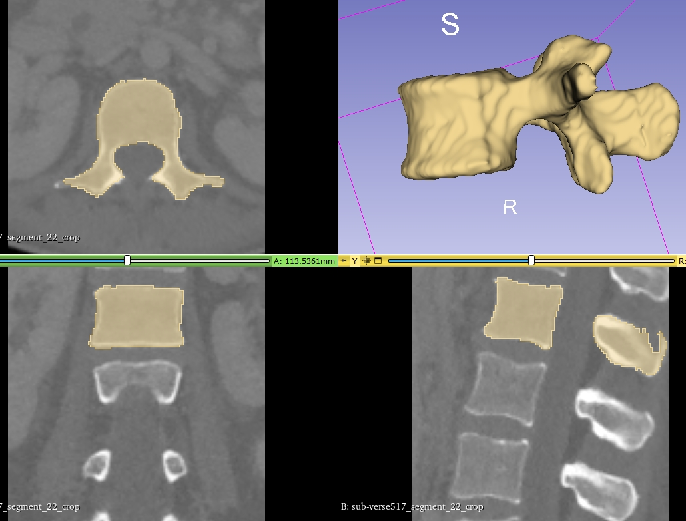
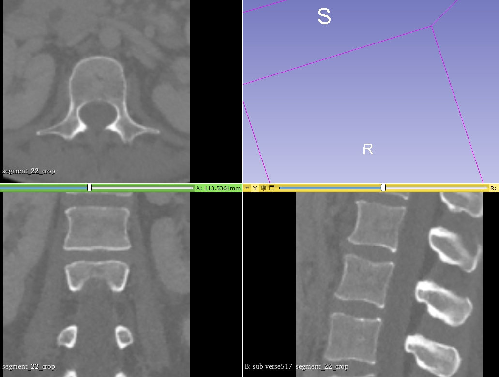
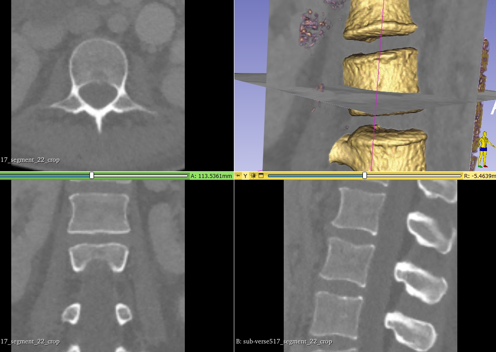
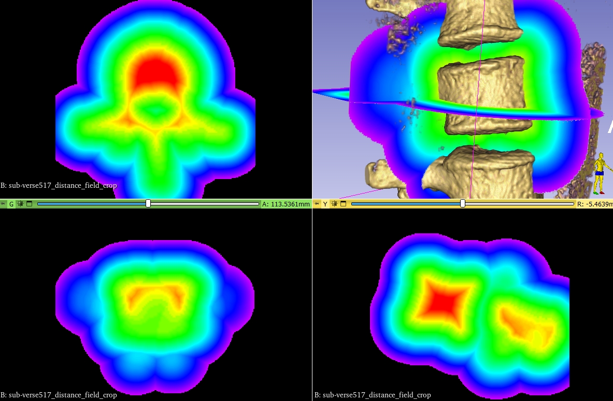
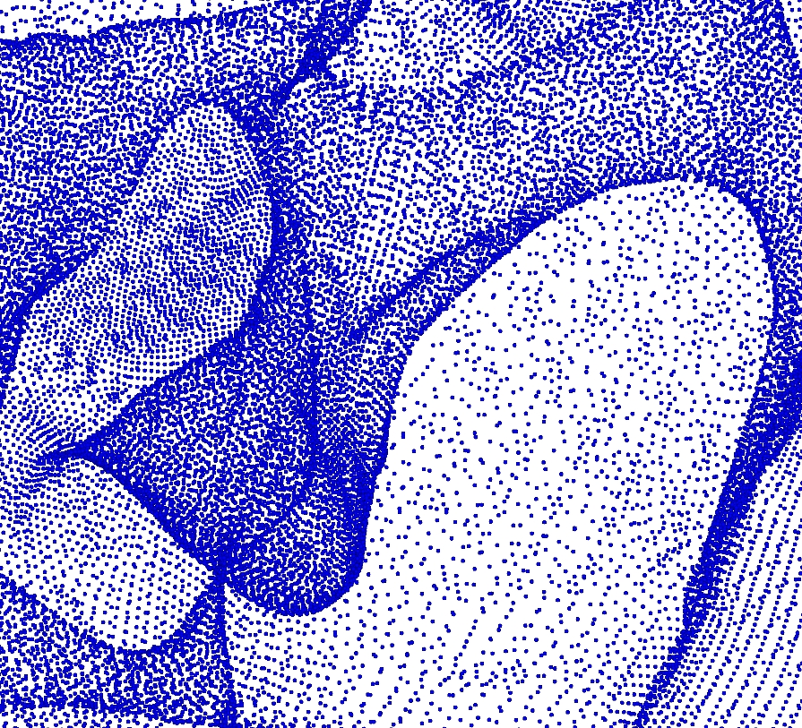
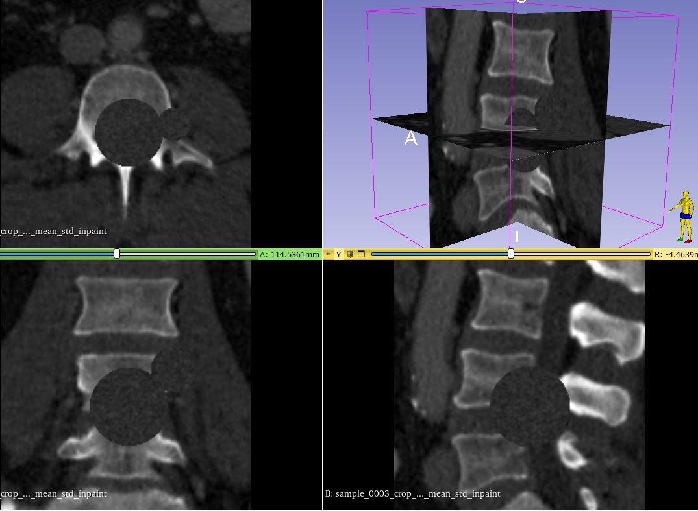
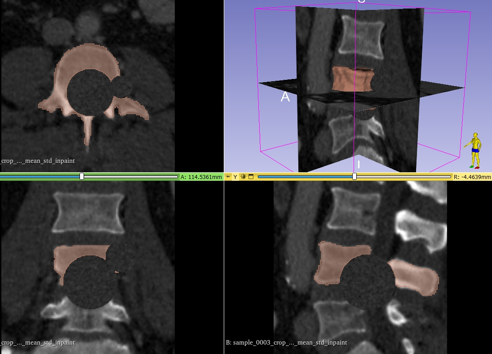

# Outlier Detection Challenge 2024
Outlier detection challenge 2024 - a DTU Compute summer school challenge

This challenge is made in conjunction with the [Ph. D. Summer school on biomedical image analysis – from acquisition to fairness and bias](https://biomed.compute.dtu.dk/). 

The goal of this challenge is to develop and evaluate algorithms for outlier detection. In this challenge, outlier detection (sometimes called novelty detection) is to detect samples that are not considered *normal*.

Specifically, the challenge is focused on the human spine where we will look at the L1 vertebra as seen on a 3D computed tomography (CT) scan. A set of normal vertebra are given and a set with artificial artefacts (outliers) is also given. Finally, a test set with both normal samples and samples with artificially outliers are provided and the goal is to determine which samples in the test set that are outliers.

**Note:** There might be *natural outliers* like fractured vertebra in the dataset. The goal of this challenge is not to predict them. It is a hard problem. Even getting ground truth fracture grading is hard. We assume that the *artificial* outliers that we have made are more severe than natural outliers. So we (hope) to have reduced the complexity of the challenge that way. 

[Summer school presentation is here.](docs/outlier-detection-challenge-2024.pdf)

## What is outlier detection?

When doing binary classification, we normally have two well described classes (cats/dogs) where it assumed that the distribution of the *features* of the samples of the classes can be described in somewhat seperated clusters.

In outlier detection, it is assumed that there is one class that is relatively well clustered (many cats) and that there are *anomalies* that do not necessarily form clusters (one tiger, one lion, two lynx, three hello kitty). The goal of outlier detection is to detect when a sample does not belong to the *normal* class. 

A vocabulary and some methods can be found in [Scikit Learn on outlier and novelty detection](https://scikit-learn.org/stable/modules/outlier_detection.html).

According to their definition, our challenge is about **novelty detection**, since we have a well known training set with known *normal* samples. The goal is to detect if *novel* samples belong to the normal class or not. We still call it an outlier detection challenge and thereby violates the definition slightly.


## Clinical background

The [spine](https://visualsonline.cancer.gov/details.cfm?imageid=12201) consists of a set of individual vertebra. Since the vertebra consist of bony material they are clearly visible on CT scans due to their high x-ray attenuation. With age, vertebra become frail and can fracture and compress. This can be seen on x-rays or CT but the diagnosis is not trivial. This challenge aims at exploring methods to detect potential fractured or compressed vertebra by considering them outliers when comparing to a normal population. We are focusing on a single vertebra and not a full spine analysis.


|                 [spine](https://visualsonline.cancer.gov/details.cfm?imageid=12201)                 |                 Lumber vertebra                 |                 CT scan with segmentation masks                 | CT Volume rendering |
|:----------------------------------------:|:---------------------------------------------:|:-------------------------------------------:|:-------------------------------------------:|
|  |  |  |  | 


## Data

The data for the challenge has been sourced from different places. Most are also part of the [CTSpine1K](https://github.com/MIRACLE-Center/CTSpine1K) data set. It has been heavily pre-processed by Andreas Aspe and Rasmus R. Paulsen for the challenge. All samples are pre-aligned using a rigid-body transformations and so on.


For all samples there are different *representations* of the data. It is important to choose the representation that is best suited for the task at hand.

### Raw data and segmentation masks (label masks)

A cropped CT scan with the original Hounsfield units and a segmentation (label) mask, where the value of each voxel indicate if it is part of the vertebra or background (=0).

|        Raw data     |
|:----------------------------------------:|
||


|        Raw data and segmentation mask     |
|:----------------------------------------:|
||


|        Raw data and 3D rendering    |
|:----------------------------------------:|
||

**Important: The label ID of the L1 vertebra is 20. This and the background (=0) are the only values from the segmenation masks that we use in this challenge.**

### Distance fields

A distance field that is a 3D voxel volume, where the value in each voxel is the signed distance to the surface of the vertebra:

|                 Distance field                 |
|:----------------------------------------:|
||

**Important: The distance field values are truncated to [-50, 50]**


### Meshes

A mesh representing the outer surface of the vertebra:


|                 Mesh                 |                 Mesh triangles                 |                 Mesh vertices                 |
|:----------------------------------------:|:---------------------------------------------:|:-------------------------------------------:|
|  |  |  |

The meshes are pre-registered and there is *point-correspondence* over the entire data set. That means that all meshes have the same number of vertices and that a vertex with a given id can be assumed to be placed on approximately the same anatomical location on all vertebra.

The coordinates of the vertices are in *physical coordinates* (mm) check below on coordinate systems, if you need to know more. If you want to use mesh coordinates to do lookup in voxel arrays, you will need to transform from *physical* coordinates to *index* coordinates.

### Artificial outliers

The outliers are artificial outliers done by modifiying the original CT scan and the label map. Below, it can be seen how a sphere outlier looks like on the original scan and the labelmap. The original voxel values have been in-painted with voxel values that are sampled from a distribution resembling the original value distributions.

|                 Sphere outlier                 |                 Label map of sphere outlier                 |
|:----------------------------------------:|:---------------------------------------------:|
|  |  |


## Data splits and naming conventions

The total set consists of 1000+ samples. They are split into:

- **train_files** : Samples that can be used for training and validation.  
- **test_files_200** : Samples that are used to compute the running scores on the score board. 
- **test_files** : Samples that will be used to compute the final score at the end of the challenge. 

All samples are named `sample_XXXX` where XXXX is a decimal number.

For the training set, there are also artificially generated outliers. For each sample there are the following outliers:

- **sphere_outlier_mean_std_inpaint** : One or more spheres has been inpainted on the vertebra with Hounsfield units similar to the region.
- **sphere_outlier_water** : One or more spheres has been inpainted on the vertebra with Hounsfield units similar to water.
- **sphere_warp_outlier** : A non-linear deformation has been applied to the region around the vertebra. 

For each sample, there is the **crop**, the **label crop**, the **distance field crop**, and the **mesh** (called a surface). This is also the case for the artificial outliers.

So for **sample_0017** the surface of the **sphere_outlier_water** is called **sample_0017_surface_sphere_outlier_water.vtk**.

### The test sets

All the samples in the test sets are simply called `sample_XXXX` even if they are outliers. A certain amount of samples in the test sets are normals and the rest are outliers (also artificially generated).

The **goal** is to assign a label to each sample in the test indicating if they are *normal (0)* or *outliers (1)*.

## Supplied Python scripts

All the supplied scripts take two arguments (except the data split script), the config file and the dataset to use. For example:
```
train_pdm_outlier_detection.py -c rasmus_pc_config.json -d custom_train_list_100.txt
```

Will use the configuration settings in `rasmus_pc_config.json` and train using a custom `custom_train_list_100.txt` set. The set is just a text file where every row is a sample name (`sample_0017` for example)

The following scripts, should be seen as simple templates that you can use as a basis for your own inpainting framework:

- `create_custom_data_splits.py`: Will generate a custom training and validation list of samples based on the total set of training data. Will also create the result directory and place the file lists in that directory.
- `train_pdm_outlier_detection.py`: Will compute a point distribution model (PDM) based on a training set
- `validate_pdm_outlier_detection.py`: Will predict samples using a pre-trained PDM and show scores based on the supplied ground truth.
- `test_pdm_outlier_detection.py`: Will predict samples from a pre-defined test set with unknown ground truth
- `submit_outlier_detections.py`: Combine the information in your configuration file with your detection results and submit them to the challenge server.
- `train_segmentation_outlier_detection.py`: Will train a very simple detection model based on segmentation volumes.
- `test_segmentation_outlier_detection.py`: Will classify samples using a pre-trained segmentation based model.


## Dependencies

The scripts have several dependencies. Among others:

- VTK 9.3.0   (very important that the version number is larger than 9.3 - something to do with direction cosines in medical scans)
- SimpleITK
- sci-kit learn
- requests

You might be better of installing with PIP than Conda (our experience with VTK).

## Tools

We mostly use [SimpleITK](https://simpleitk.readthedocs.io/en/master/index.html#) for image reading/writing and for 3D image manipulations. (see the segmentation example scripts for usage).

For 3D surface processing, we use [The Visualization Toolkit (VTK)](https://vtk.org/). VTK also has very powerfull 3D visualization tools. (see the PDM based example scripts for usage).

Sometimes it is necessary to convert from SimpleITK to VTK and the other way around. SimpleITK has some very good image readers and writers while VTK for example can extract iso-surfaces from scans and label maps.

We highly recommend to use 3D slicer to visualize the data:
[3D Slicer](https://www.slicer.org/)

It can be used for both the NIFTI files (.nii.gz) and the mesh/surface files (.vtk).

[Sumatra](http://fungi.compute.dtu.dk:8080/software) is a surface viewer that can load several surfaces fast. Only windows and you might get a lot of anti-virus warning when try to download it. It is safe though.

## Data on the DTU HPC cluster

For participants that are already users of the [DTU HPC cluster](https://www.hpc.dtu.dk/?page_id=2501), we have placed the data here:

```
/work3/rapa/challenge_data/
```

It is **read-only** so you can process it from there but need to place output in your own space.


## Getting started

There are several example scripts that can get you started. Here is an example, where you build a [point distribution model (PDM)](https://en.wikipedia.org/wiki/Point_distribution_model) based on the surface meshes. The distribution of PCA components is then used to decide the outliers.

- Download the data from [FileSender](https://filesender.deic.dk/?s=download&token=b7b99cb3-825b-4d91-a5d6-0f526fd77e55) (130 GB) and unpack it a suitable place.
- Clone this repository or download it as a zip and unpack.
- Create a copy of `outlier-challenge-config.json` or edit it directly.
- Find a fantastic team name (only using letters and numbers) and put it into the config file.
- Change the data folders in the config file to match your local setup.
- Run `create_custom_data_splits.py -c outlier-challenge-config.json` : This will create the result directory, copy the provided file lists there and generate custom lists of samples (names in text file) in the result directory. Check them.
- Run `train_pdm_outlier_detection.py -c outlier-challenge-config.json -d custom_train_list_100.txt` . This will train a PDM model using your custom set of training samples. It will also synthesize shapes showing a mean shape and major modes of variations. Use 3D Slicer or Sumatra to visualize them.
- Run `validate_pdm_outlier_detection.py -c outlier-challenge-config.json -d custom_validation_list_100.txt` . This will evaluate the PDM model using your custom validation set.
- Run `test_pdm_outlier_detection.py -c outlier-challenge-config.json -d test_files_200.txt` . This will predict outliers on a test set.
- Run `submit_outlier_detections.py -c outlier-challenge-config.json -d test_files_200.txt`. This will submit your test predictions to the test server.

**DO NOT** change the sample ids in the provided `test_files_200.txt` and `test_files.txt`. They should be fixed by all teams.

## Describing your method and data in the config file

The JSON config file has a field called `method`. Here you should supply a simple description of your method with no special letters. For example `PDM with distance threshold`, `Segmentation volume with flexible threshold`, `Distance field shape analysis with Mahalanobis distance`. This is used on the scoreboard.

There is also a field called `data_types` where you should specify what data your data is using: **mesh**, **segmentation**, **image**, **mesh+segmenation** etc.

## Submitting results

The submission script `submit_results.py` takes as input your JSON configuration file. It will use that to locate your outlier detection result JSON file and couple that with the information provided in your config file (team name, method description and data types). Finally, it will send a merged JSON file to the challenge server.

During the summer school, the challenge board will contain results from the **test_files_200.txt** set. 

The **FINAL** result will be computed on the predictions you have submmited using the full test set in **test_files.txt**.


## Outlier detection evaluations

The detections are evaluated using metrics similar to the metrics used in binary classication tasks. They are defined using the:

- The number of true positives (TP)
- The number of false positives (FP)
- The number of true negatives (TN)
- The number of false negatives (FN)

The metrics we compute are: 

- Accuracy
- Precision
- Recall
- F1
- Cohens Kappa


## The challenge score board

You can see how your amazing methods is performing on the [challenge score board](http://fungi.compute.dtu.dk:8080/).

## Inspirations

There are many ways of detecting outliers/anomalies. Here are a few pointers:

### Feature based outlier detection

Feature based detection is a classical machine learning approach. You can for example use the point cloud or the segmentation to extract high-level features as volumes, spheriocity and so on. Alternatively, you can use principal component analysis on the samples (as demonstrated in the PDM scripts). You can then use classical methods from multivariate-statistics like Mahalanobis distances on PCA loadings or features. You can also experiment with the methods [here](https://scikit-learn.org/stable/modules/outlier_detection.html). 

### VAE based outlier detection

An auto-encoder or a variational autoencoder can be trained on normal samples. For example single slices or full volumes of the image or the distance fields. The hypothesis is that when it is presented for an outlier it will try to synthesize a *normal* version of the sample. The difference between the input and the reconstruction can be considered a measure for the degree of outlier.

[VAE based anomaly detection](https://towardsdatascience.com/hands-on-anomaly-detection-with-variational-autoencoders-d4044672acd5)


### Other approaches

- [Towards Total Recall in Industrial Anomaly Detection](https://github.com/amazon-science/patchcore-inspection)
- [Generalizing Unsupervised Anomaly Detection: Towards Unbiased Pathology Screening](https://github.com/ci-ber/RA)
- [Anomaly Detection in Medical Imaging With Deep Perceptual Autoencoders](https://github.com/ninatu/anomaly_detection)

## Something about painful 3D volume coordinate systems

One major head ache when dealing with 3D images is the choice of coordinate systems. We are, at least, using these systems:

- The CT scans *physical* coordinate system that is typically measured in mm and describes the coordinates inside the patient/scanner.
- The index based coordinate system of the CT scan (indeces are integers)
- The index based coordinate system as a Numpy 3D array. A transpose operation is needed to convert between SimpleITK and Numpy indices. (Unless you have already transposed the entire Numpy array after getting it from SimpleITK)

For example:
```python
# Do the transpose of the coordinates (SimpleITK vs. numpy)
p_itk = [p_np[2], p_np[1], p_np[0]]
```

There are also different conventions used in medical scanners (LPS, RAS etc)

More details here:

- [SimpleITK coordinate systems](https://simpleitk.readthedocs.io/en/master/fundamentalConcepts.html)
- [3D slicer coordinate systems](https://slicer.readthedocs.io/en/latest/user_guide/coordinate_systems.html)

There are methods in SimpleITK to convert forth and back from *physical* coordinates and *index* coordinates.

This code will get the *physical* coordinates of a voxel where you supply the index values:
```python
p_phys = img.TransformIndexToPhysicalPoint([int(p_index[0]), int(p_index[1]), int(p_index[2])])
```

and with this: 
```python
p_index = img_label.TransformPhysicalPointToIndex(p_phys)
```
you will get index coordinates by given physical coordinates (floating point in millimeters).


