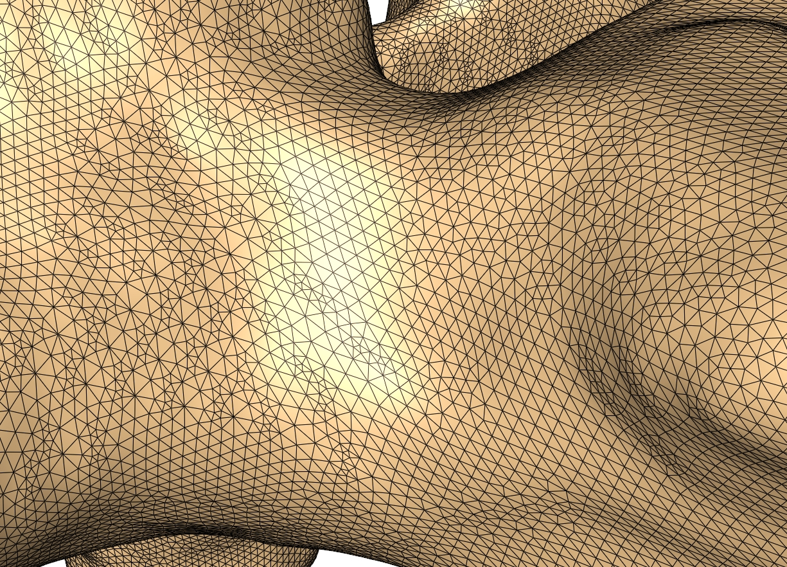

# Outlier Detection Challenge 2024
Outlier detection challenge 2024 - a DTU Compute summer school challenge

This challenge is made in conjunction with the [Ph. D. Summer school on biomedical image analysis – from acquisition to fairness and bias](https://biomed.compute.dtu.dk/). The Ph. D. summer school specific information can be found TBD.

The goal of this challenge is to develop and evaluate algorithms for outlier detection. In this challenge, outlier detection (sometimes called novelty detection) is to detect samples that are not considered *normal*.

Specifically, the challenge is focused on the human spine where we will look at the L1 vertebra as seen on a 3D computed tomography (CT) scan. A set of normal vertebra are given and a set with artificial artefacts (outliers) is also given. Finally, a test set with both normals and outliers are provided and the goal is to determine which samples in the test set that are outliers.

## Clinical background

The [spine](https://visualsonline.cancer.gov/details.cfm?imageid=12201) consists of a set of individual vertebra:
 
 

Three orthogonal slices of a CT scan with overlaid segmentation masks:

 

Volume rendering of a CT scan of the spine: 
 

## Data

For all samples there are different *representations* of the data. It is important to choose the representation that is best suited for the task at hand.

### Raw data and segmentation masks

A cropped CT scan with the original Hounsfield units and a segmentation mask, where the value of each voxel indicate if it is part of the vertebra or background (=0).

|        Raw data     |
|:----------------------------------------:|
||

|        Raw data and segmentation mask     |
|:----------------------------------------:|
||

|        Raw data and 3D rendering    |
|:----------------------------------------:|
||

### Distance fields

A distance field that is a 3D voxel volume, where the value in each voxel is the signed distance to the surface of the vertebra:

|                 Distance field                 |
|:----------------------------------------:|
||

### Meshes

A mesh representing the outer surface of the vertebra:

|                 Mesh                 |                 Mesh triangles                 |                 Mesh vertices                 |
|:----------------------------------------:|:---------------------------------------------:|:-------------------------------------------:|
|  |  |  |

The meshes are pre-registered and there is *point-correspondence* over the entire data set. That means that all meshes have the same number of vertices and that a vertex with a given id can be assumed to be place on approximately the same anatomical location on all vertebra.

## Data splits and naming conventions

The total set consists of 1000 samples. They are split into:

- **Training samples** : Samples that can be used for training and validation.  (`training_samples.txt`)
- **Test samples** : Samples that are used to compute the running scores on the score board. (`test_samples.txt`)
- **Final test samples** : Samples that will be used to compute the final score at the end of the challenge. (`final_test_samples.txt`)

All samples are named `samples_XXXX` where XXXX is a decimal number.

For the training set, there are also artificially generated outliers. For each sample there are the following outliers:

- **sphere_outlier_mean_std_inpaint** : One or more spheres has been inpainted on the vertebra with Hounsfield units similar to the region.
- **sphere_outlier_water** : One or more spheres has been inpainted on the vertebra with Hounsfield units similar to water.
- **sphere_warp_outlier** : A non-linear deformation has been applied to the region around the vertebra. 

For each sample, there is the **crop**, the **label crop**, the **distance field crop**, and the **mesh** (called a surface). This is also the case for the artificial outliers.

So for **sample_0017** the surface of the **sphere_outlier_water** is called **sample_0017_surface_sphere_outlier_water.vtk**.

 

## Supplied Python scripts

## Dependencies

## Tools

We highly recommend to use 3D slicer to visualize the data:
[3D Slicer](https://www.slicer.org/)

It can be used for both the NIFTI files (.nii.gz) and the mesh/surface files (.vtk).

## Gettings started

## Configuring your submission

## Outlier detection evaluations

## The challenge score board

## Inspirations

### PCA based outlier detection

### Segmentation based outlier detection

### VAE based outlier detection
Single slice vs full volume

## Links and material

- [Scikit Learn on outlier and novelty detection](https://scikit-learn.org/stable/modules/outlier_detection.html)

