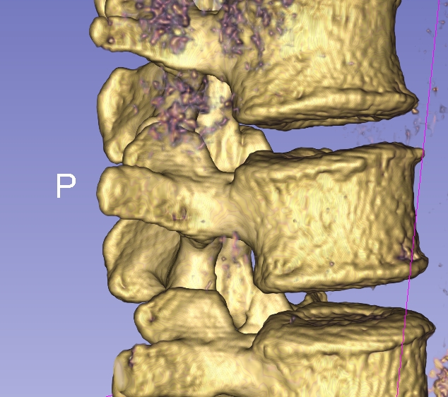

# Outlier Detection Challenge 2024
Outlier detection challenge 2024 - a DTU Compute summer school challenge

This challenge is made in conjunction with the [Ph. D. Summer school on biomedical image analysis – from acquisition to fairness and bias](https://biomed.compute.dtu.dk/). The Ph. D. summer school specific information can be found TBD.

The goal of this challenge is to develop and evaluate algorithms for outlier detection. In this challenge, outlier detection (sometimes called novelty detection) is to detect samples that are not considered *normal*.

Specifically, the challenge is focused on the human spine where we will look at the L1 vertebra as seen on a 3D computed tomography (CT) scan. A set of normal vertebra are given and a set with artificial artefacts (outliers) is also given. Finally, a test set with both normals and outliers are provided and the goal is to determine which samples in the test set that are outliers.

## Clinical background

The [spine](https://visualsonline.cancer.gov/details.cfm?imageid=12201) consists of a set of individual vertebra:
 
 

Three orthogonal slices of a CT scan with overlaid segmentation masks:

 

Volume rendering of a CT scan of the spine: 
 

## Data

A distance field that is a 3D voxel volume, where the value in each voxel is the signed distance to the surface of the vertebra:
 

A cropped CT scan with the original Hounsfield units and a segmentation mask, where the value of each voxel indicate if it is part of the vertebra or background (=0).
 

A mesh representing the outer surface of the vertebra:

|                 Mesh                 |                 Mesh triangles                 |                 Mesh vertices                 |
|:----------------------------------------:|:---------------------------------------------:|:-------------------------------------------:|
|  |  |  |

### Raw data

### Segmentation

### Distance fields

### Meshes

## Supplied Python scripts

## Dependencies

## Gettings started

## Configuring your submission

## Outlier detection evaluations

## The challenge score board

## Inspirations

### PCA based outlier detection

### Segmentation based outlier detection

### VAE based outlier detection
Single slice vs full volume

## Links and material

- [Scikit Learn on outlier and novelty detection](https://scikit-learn.org/stable/modules/outlier_detection.html)

