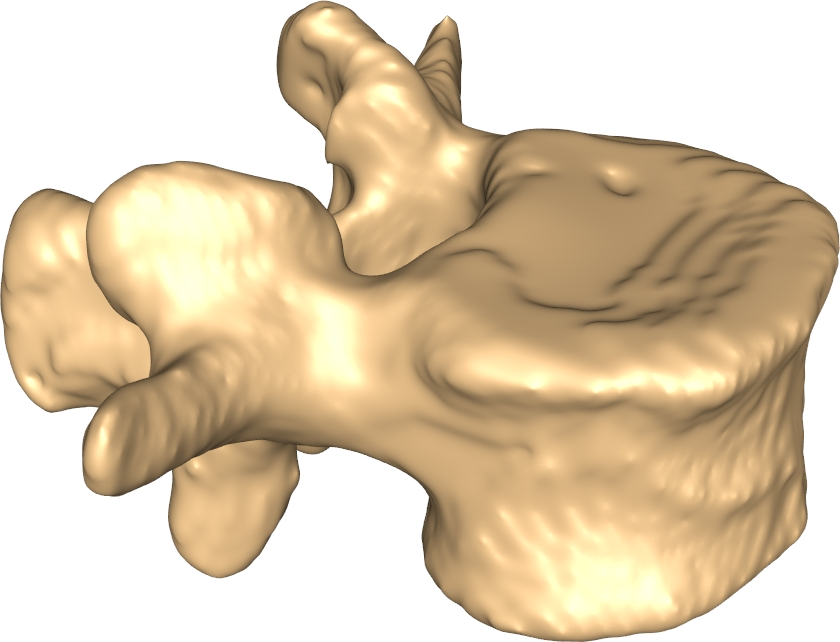

# Outlier Detection Challenge 2024
Outlier detection challenge 2024 - a DTU Compute summer school challenge

This challenge is made in conjunction with the [Ph. D. Summer school on biomedical image analysis – from acquisition to fairness and bias](https://biomed.compute.dtu.dk/). The Ph. D. summer school specific information can be found TBD.

The goal of this challenge is to develop and evaluate algorithms for outlier detection. In this challenge, outlier detection (sometimes called novelty detection) is to detect samples that are not considered *normal*.

Specifically, the challenge is focused on the human spine where we will look at the L1 vertebra as seen on a 3D computed tomography (CT) scan. A set of normal vertebra are given and a set with artificial artefacts (outliers) is also given. Finally, a test set with both normals and outliers are provided and the goal is to determine which samples in the test set that are outliers.

## Clinical background

The [spine](https://visualsonline.cancer.gov/details.cfm?imageid=12201) consists of a set of individual vertebra. Since the vertebra consist of bony material they are clearly visible on CT scans due to their high x-ray attenuation. With age, vertebra become frail and can fracture and compress. This can be seen on x-rays or CT but the diagnosis is not trivial. This challenge aims at exploring methods to detect potential fractured or compressed vertebra by considering them outliers when comparing to a normal population. We are focusing on a single vertebra and not a full spine analysis.


|                 [spine](https://visualsonline.cancer.gov/details.cfm?imageid=12201)                 |                 Lumber vertebra                 |                 CT scan with segmentation masks                 | CT Volume rendering |
|:----------------------------------------:|:---------------------------------------------:|:-------------------------------------------:|:-------------------------------------------:|
|  |  |  |  | 


## Data

For all samples there are different *representations* of the data. It is important to choose the representation that is best suited for the task at hand.

### Raw data and segmentation masks

A cropped CT scan with the original Hounsfield units and a segmentation mask, where the value of each voxel indicate if it is part of the vertebra or background (=0).

|        Raw data     |
|:----------------------------------------:|
||


|        Raw data and segmentation mask     |
|:----------------------------------------:|
||


|        Raw data and 3D rendering    |
|:----------------------------------------:|
||

### Distance fields

A distance field that is a 3D voxel volume, where the value in each voxel is the signed distance to the surface of the vertebra:

|                 Distance field                 |
|:----------------------------------------:|
||


### Meshes

A mesh representing the outer surface of the vertebra:


|                 Mesh                 |                 Mesh triangles                 |                 Mesh vertices                 |
|:----------------------------------------:|:---------------------------------------------:|:-------------------------------------------:|
|  |  |  |

The meshes are pre-registered and there is *point-correspondence* over the entire data set. That means that all meshes have the same number of vertices and that a vertex with a given id can be assumed to be place on approximately the same anatomical location on all vertebra.

The data has been sourced from different places. Most are also part of the [CTSpine1K](https://github.com/MIRACLE-Center/CTSpine1K) data set.

## Data splits and naming conventions

The total set consists of 1000 samples. They are split into:

- **Training samples** : Samples that can be used for training and validation.  (`training_samples.txt`)
- **Test samples** : Samples that are used to compute the running scores on the score board. (`test_samples.txt`)
- **Final test samples** : Samples that will be used to compute the final score at the end of the challenge. (`final_test_samples.txt`)

All samples are named `sample_XXXX` where XXXX is a decimal number.

For the training set, there are also artificially generated outliers. For each sample there are the following outliers:

- **sphere_outlier_mean_std_inpaint** : One or more spheres has been inpainted on the vertebra with Hounsfield units similar to the region.
- **sphere_outlier_water** : One or more spheres has been inpainted on the vertebra with Hounsfield units similar to water.
- **sphere_warp_outlier** : A non-linear deformation has been applied to the region around the vertebra. 

For each sample, there is the **crop**, the **label crop**, the **distance field crop**, and the **mesh** (called a surface). This is also the case for the artificial outliers.

So for **sample_0017** the surface of the **sphere_outlier_water** is called **sample_0017_surface_sphere_outlier_water.vtk**.

### The test sets
All the samples in the test sets are simply called `sample_XXXX` even if they are outliers. 

The **goal** is to assign a label to each sample in the test indicating if they are *normal (0)* or *outliers (1)*.

## Supplied Python scripts

All the supplied scripts take two arguments, the config file and the dataset to use. For example:
```
train_pdm_method.py -c rasmus_pc_config.json -d rasmus_training_split.txt
```

Will use the configuration settings in `rasmus_pc_config.json` and train using a custom `rasmus_training_split.txt` set. The set is just a text file where every row is a sample name (`sample_0017` for example)

The following scripts, should be seen as simple templates that you can use as a basis for your own inpainting framework:

- `train_pdm_method.py`: Will compute a point distribution model (PDM)
- `test_pdm_method.py`: Will classify samples using a pre-trained PDM
- `train_segmentation_method.py`: Will train a very simple detection model based on segmentation volumes.
- `test_segmentation_method.py`: Will classify samples using a pre-trained segmentation based model.
- `evaluate_outlier_detection.py`: Will compute metrics (TBD)
- `submit_results.py`: Combine the information in your configuration file with your detection results and submit them to the Challenge server.


## Dependencies

- VTK 9.3.0 
- SimpleITK


## Tools

We highly recommend to use 3D slicer to visualize the data:
[3D Slicer](https://www.slicer.org/)

It can be used for both the NIFTI files (.nii.gz) and the mesh/surface files (.vtk).

[Sumatra (TBD)](people.compute.dtu.dk/rapa) is a surface viewer that can load several surfaces fast.

## Getting started

There are several example scripts that can get you started. Here is an example, where you build a [point distribution model (PDM)](https://en.wikipedia.org/wiki/Point_distribution_model) based on the surface meshes. The distribution of PCA components is then used to decide the outliers.

- Download the data [TBD](https://people.compute.dtu.dk/rapa/) and unpack it a suitable place.
- Clone this repository or download it as a zip and unpack.
- Create a copy of `outlier-challenge-config.json` or edit it directly.
- Find a fantastic team name (only using letters and numbers) and put it into the config file.
- Change the data folders in the config file to match your local setup.
- Try to run `train_pdm_method.py` with the **training** set.
- Try to run `test_pdm_method.py` with the **test** set.
- Try to run `submit_results.py` with the **test** set.

We encourage you to split the **training** set into smaller sets for your own purpose (training, validation etc).

**DO NOT** change the sample ids in the provided test and final_test sets. They should be fixed by all teams.

## Describing your method in the config file

The JSON config file has a field called `method`. Here you should supply a simple description of your method with no special letters. For example `PDM with distance threshold`, `Segmentation volume with flexible threshold`, `Distance field shape analysis with Mahalanobis distance`. This is used on the scoreboard.

## Submitting results

The submission script `submit_results.py` takes as input your JSON configuration file. It will use that to locate your outlier detection result JSON file and couple that with the information provided in your config file (team name and method description). Finally, it will send a merged JSON file to the challenge server.

## Outlier detection evaluations

## The challenge score board

## Inspirations

### PCA based outlier detection

### Segmentation based outlier detection

### VAE based outlier detection
Single slice vs full volume


## Links and material

- [Scikit Learn on outlier and novelty detection](https://scikit-learn.org/stable/modules/outlier_detection.html)

